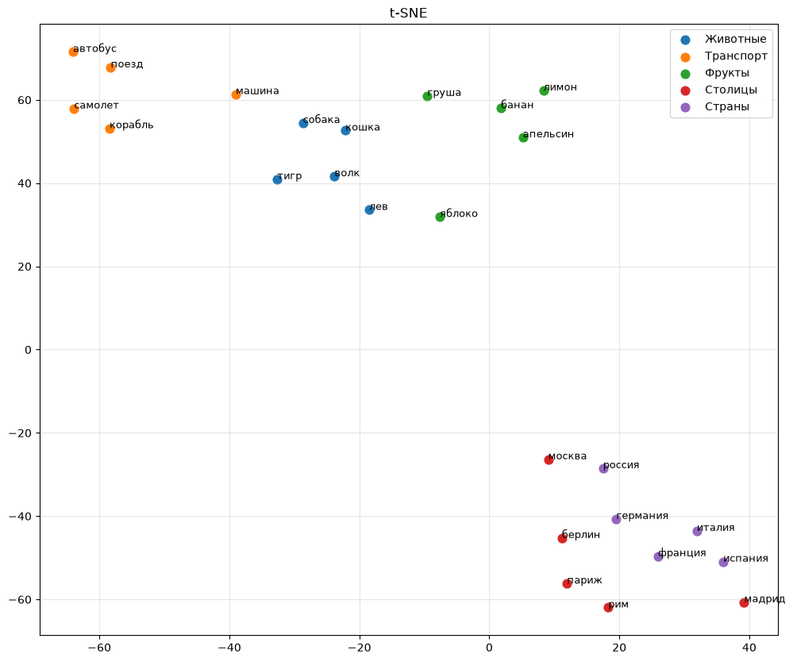

# Обучение моделей Word2Vec на русскоязычной Википедии

## О проекте

В рамках проекта реализовано воспроизведение алгоритма Word2Vec для русского языка на основе корпуса русскоязычной Википедии. Проект включает подготовку текстового корпуса, обучение моделей CBOW и Skip-gram, генерацию набора аналогий и оценку качества обученных моделей с использованием библиотеки Gensim.

<p align="center">
  
  <br>
  <em>Рисунок 1. Визуализация векторных представлений слов, полученных моделью Skip-gram, методом t-SNE.</em>
</p>

---

## Структура проекта

```text
word2vec-wiki-ru/
├── data/
├── models/
├── notebooks/
├── src/
├── README.md
├── LICENSE
└── requirements.txt
```

---

## Используемые данные

В качестве исходных данных использован дамп статей русскоязычной Википедии в формате XML (ruwiki-latest-pages-articles.xml.bz2). Корпус был получен с официального сайта Wikimedia и содержит тексты энциклопедических статей без страниц обсуждений, служебных страниц и истории изменений.

На этапе подготовки корпуса из дампа были извлечены тексты статей, выполнена очистка от вики-разметки, HTML-тегов, ссылок, шаблонов, специальных символов и лишних пробельных символов. После очистки полученный текст был сохранен в виде текстового корпуса, использованного для обучения моделей Word2Vec.

* исходный дамп: ruwiki-latest-pages-articles.xml.bz2;
* обработано статей: 3 441 169;
* сохранено статей: 3 085 786;
* размер итогового корпуса: 15,65 ГБ.

---

## Обучение моделей

Для обучения использована библиотека **Gensim**. Были обучены две модели Word2Vec с архитектурами **CBOW** и **Skip-gram** на одном и том же подготовленном корпусе.

При обучении использовались следующие параметры:

| Параметр | Значение |
|----------|---------:|
| Размерность векторов | 100 |
| Размер контекстного окна | 5 |
| Минимальная частота слова | 50 |
| Количество эпох | 5 |
| Начальное значение генератора случайных чисел (seed) | 42 |
| Архитектура | CBOW (`sg=0`), Skip-gram (`sg=1`) |

Обе модели обучались с одинаковыми параметрами, что позволило провести корректное сравнение качества моделей.

---

## Оценка качества

Для оценки качества моделей использован набор аналогий, сформированный на основе исходного списка пар слов. Для каждой категории автоматически генерировались аналогии вида:

```
A : B = C : D
```

Полученный набор включает как семантические, так и синтаксические аналогии.

Оценка выполнялась с использованием метода `evaluate_word_analogies()` библиотеки Gensim. Для каждой модели вычислялась общая точность (Accuracy), а также точность отдельно по семантическим и синтаксическим категориям. Дополнительно рассчитывалась точность для каждой категории аналогий, что позволило провести детальное сравнение качества моделей CBOW и Skip-gram.

Набор аналогий включает следующие категории:

| Тип | Категория | Описание |
|------|-----------|----------|
| Семантическая | `capital-common-countries` | столица — страна |
| Семантическая | `family` | семейные отношения |
| Семантическая | `currency` | страна — валюта |
| Синтаксическая | `comparative` | образование сравнительной степени прилагательных |
| Синтаксическая | `superlative` | образование превосходной степени прилагательных |
| Синтаксическая | `plural-nouns` | образование множественного числа существительных |
| Синтаксическая | `nationality` | образование названий национальностей |
| Синтаксическая | `opposite` | образование слов с противоположным значением |
| Синтаксическая | `adjective-to-adverb` | образование наречий от прилагательных |
| Синтаксическая | `past-tense` | образование прошедшего времени глаголов |
| Синтаксическая | `present-participle` | образование действительных причастий настоящего времени |
| Синтаксическая | `country-language` | страна — язык |
| Синтаксическая | `male-female-profession` | мужской и женский род названий профессий |

---

## Результаты

В результате обучения были получены две модели Word2Vec: **CBOW** и **Skip-gram**. Их качество оценивалось на задаче решения аналогий.

| Модель | Общая Accuracy | Семантические аналогии | Синтаксические аналогии |
|--------|---------------:|-----------------------:|------------------------:|
| CBOW | **51.04%** | 59.54% | 45.23% |
| Skip-gram | **59.46%** | 77.62% | 47.06% |

Полученные результаты показывают, что модель **Skip-gram** превзошла **CBOW** по общей точности, улучшив качество решения аналогий почти на 8 процентных пунктов.

Наибольшее преимущество Skip-gram продемонстрировала при решении семантических аналогий (77.62% против 59.54%). Особенно заметен прирост в категории **capital-common-countries**, где точность увеличилась с 55.59% до 82.58%.

Для синтаксических аналогий различия между моделями оказались менее выраженными. Skip-gram показала небольшое преимущество в общей точности (47.06% против 45.23%), однако результаты по отдельным категориям различаются. Обе модели успешно справились с категориями **nationality**, **country-language** и **male-female-profession**, тогда как категории **superlative** и **adjective-to-adverb** оказались наиболее сложными.

Таким образом, результаты эксперимента подтверждают выводы, приведенные в оригинальных работах по Word2Vec: архитектура **Skip-gram** обеспечивает более качественные векторные представления слов, особенно при решении семантических задач, хотя требует больших вычислительных затрат по сравнению с **CBOW**.

### Влияние количества эпох на качество моделей

Дополнительно было исследовано влияние увеличения числа эпох обучения с 5 до 8.

| Модель | Общая Accuracy | Semantic | Syntactic |
|--------|---------------:|---------:|----------:|
| CBOW (5 эпох) | 51.04% | 59.54% | 45.23% |
| CBOW (8 эпох) | 51.06% | 60.48% | 44.63% |
| Skip-gram (5 эпох) | 59.46% | 77.62% | 47.06% |
| Skip-gram (8 эпох) | **60.22%** | **78.56%** | **47.71%** |

Увеличение числа эпох с 5 до 8 практически не повлияло на качество модели **CBOW**. Общая точность возросла лишь на **0.02 процентного пункта**, при этом наблюдалось незначительное улучшение качества решения семантических аналогий и небольшое снижение качества на синтаксических аналогиях.

Для модели **Skip-gram** увеличение числа эпох оказалось более эффективным. Общая точность увеличилась с **59.46%** до **60.22%**, при этом улучшение наблюдалось как для семантических аналогий (с **77.62%** до **78.56%**), так и для синтаксических (с **47.06%** до **47.71%**).

Полученные результаты показывают, что увеличение числа эпох оказывает положительное влияние преимущественно на модель **Skip-gram**, тогда как качество модели **CBOW** после пяти эпох практически достигает насыщения.

---

## Установка

```bash
git clone ...
cd word2vec-wiki-ru
pip install -r requirements.txt
```

---

## Запуск проекта

1. Подготовка корпуса.
2. Обучение моделей.
3. Оценка качества.

---

## Используемые библиотеки

- Python
- Gensim
- Pandas
- Jupyter Notebook

---

## Список литературы

## Список литературы

1. Mikolov T., Chen K., Corrado G., Dean J. *Efficient Estimation of Word Representations in Vector Space*. 2013.
2. Mikolov T., Sutskever I., Chen K., Corrado G., Dean J. *Distributed Representations of Words and Phrases and their Compositionality*. 2013.
3. Документация Gensim. https://radimrehurek.com/gensim/
4. Wikimedia Downloads. https://dumps.wikimedia.org/

---

## Лицензия

Проект распространяется по лицензии MIT.